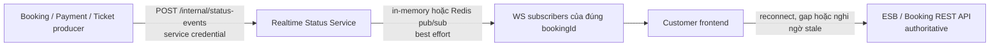

# Realtime Status Service

FastAPI service đẩy projection tiến trình booking đến trình duyệt qua WebSocket. Service này **không authoritative**: Booking Service/ESB vẫn là nguồn sự thật, WebSocket không nằm trên critical path và lỗi realtime không được làm booking fail hoặc rollback.

## Ranh giới và luồng dữ liệu



Service chỉ giữ connection, subscription theo `bookingId`, heartbeat, message-id dedup và sequence gần nhất trong cache có TTL/kích thước giới hạn. Không có database, migration, booking state machine, durable event log hay cross-service database access.

## Endpoint

| Endpoint | Chức năng |
|---|---|
| `WS /ws/bookings/{bookingId}` | Subscription đã xác thực và kiểm tra ownership |
| `POST /internal/status-events` | Nhận status projection từ caller nội bộ |
| `GET /connections/health` | Aggregate connection/backend health, không lộ subscriber |
| `GET /health/live` | Process liveness |
| `GET /health/ready` | Draining/backend readiness |
| `GET /metrics` | Prometheus exposition |

HTTP error dùng envelope ổn định:

```json
{
  "correlationId": "corr-123",
  "error": {
    "code": "INVALID_REQUEST",
    "message": "Status event payload is invalid",
    "retryable": false,
    "details": {}
  }
}
```

`POST /internal/status-events` yêu cầu `Content-Type: application/json`, `X-Service-Token`, `X-Caller-Service`, và hỗ trợ `X-Correlation-ID`. Payload được đọc theo stream với hard size limit, Pydantic `extra="forbid"`, identifier/status/time/message validation và kiểm tra nội dung nhạy cảm cơ bản. Response `outcome` phân biệt `accepted`, `no_subscribers`, `duplicate`, `stale`; `sequenceGap` cho biết gap. Backend publish failure trả `503 BROADCAST_UNAVAILABLE` và marker dedup được rollback để producer có thể retry.

## Status event và WebSocket protocol

Status frame giữ nguyên contract projection:

```json
{
  "messageId": "unique-message-id",
  "bookingId": "BK-123",
  "status": "PENDING",
  "sequence": 1,
  "occurredAt": "2026-08-03T03:00:00Z",
  "correlationId": "correlation-id",
  "message": "Booking is being processed"
}
```

Control frames luôn có `type`:

- `connected`: có `bookingId`, `heartbeatIntervalSeconds`.
- `heartbeat`: có RFC 3339 `timestamp`; client trả chính xác `{"type":"pong"}`.
- `resync_required`: có `reason`, `bookingId`, `authoritativeUrl` và sequence liên quan nếu có.
- `protocol_error`: mã an toàn `INVALID_MESSAGE` hoặc `MESSAGE_TOO_LARGE`.
- `shutdown`: báo reconnect và REST resync.

Close codes ổn định:

| Code | Ý nghĩa |
|---:|---|
| `4401` | Chưa xác thực/JWT không hợp lệ |
| `4403` | Không có quyền booking |
| `4406` | Origin không hợp lệ |
| `4408` | ESB ticket authentication timeout |
| `4429` | Handshake/connection limit |
| `4400` | Protocol hoặc client payload không hợp lệ |
| `1012` | Server draining/restart |
| `1001` | Heartbeat idle timeout |

Một booking hỗ trợ nhiều tab/subscriber; registry cô lập channel theo `bookingId`. Broadcast copy danh sách connection dưới lock rồi send song song ngoài lock. Mỗi send có timeout; client chậm/hỏng bị loại mà không chặn vô hạn các client khác. Cleanup idempotent chạy khi disconnect, exception, timeout và shutdown.

## Authentication và booking authorization

Browser nên truyền access token bằng WebSocket subprotocol, tránh URL:

```js
new WebSocket(url, ["bearer", accessToken]);
```

Server chọn subprotocol `bearer`. `Authorization: Bearer` cũng được hỗ trợ cho non-browser clients. Query `access_token` bị tắt mặc định và production validation cấm bật; chỉ có thể bật bằng `REALTIME_ALLOW_QUERY_TOKEN=true` để tương thích local tạm thời. Token trong URL có thể lọt vào proxy/access log nên **không dùng chế độ này trong production**.

JWT được xác minh chữ ký RS256, `kid`, `iss`, `aud`, `exp`, `iat`, và `nbf` nếu có. JWKS có timeout, TTL cache, lock chống refresh đồng thời và force-refresh khi gặp `kid` mới. Không decode bỏ qua signature và không log token/header/cookie/query/raw frame.

`BookingAccessChecker` là protocol có thể thay fake trong test. Production adapter:

- cho role trong `REALTIME_ADMIN_ROLES` bypass ownership theo policy rõ ràng;
- với customer, gọi `REALTIME_BOOKING_AUTHORIZATION_URL` bằng credential nội bộ, caller, actor và correlation ID;
- chấp nhận response quyết định `{ "allowed": true }`, hoặc so `customerId` authoritative với signed JWT `customerId`/`sub`;
- timeout ngắn và fail closed trên 4xx/5xx, response không đúng contract hoặc network error.

Mặc định khi chạy trực tiếp trên host là `http://localhost:8004/bookings/{bookingId}`. Trong network Compose, dùng DNS/internal port của provider: `http://booking-service:8000/bookings/{bookingId}`; không dùng host port hoặc Notification Service port cho traffic container-to-container.

Repository hiện chưa có contract hoàn chỉnh mapping Identity `sub` sang Customer. Identity hiện cũng chưa phát `customerId`. Vì vậy production cần bổ sung ngoài service một authorization endpoint ở ESB/Booking trả quyết định `allowed`, hoặc bổ sung signed identity/customer mapping chính thức. Cho đến khi có dependency đó, customer không xác minh được mapping sẽ bị từ chối; service không fallback allow.

### ESB signed ticket mode

The customer frontend uses `POST /api/realtime/ws-tickets` on the ESB, then opens the booking WebSocket without a query token and sends `{"type":"authenticate","ticket":"..."}` within five seconds. Realtime verifies RS256 signature, issuer, audience, subject, booking ID, scope, `iat`, `exp`, and `jti`; the ticket TTL cannot exceed 60 seconds and the booking claim must match the path. A `jti` is consumed atomically before subscription. The in-memory replay store is bounded for one-process local use only when Redis is not configured. When `REALTIME_REDIS_URL` is configured, replay protection exclusively uses atomic Redis `SET NX EX` across replicas and never falls back to memory. Raw tickets are never stored or logged.

This is additive. Native Identity JWT authentication through the `bearer` WebSocket subprotocol remains supported and still calls `BookingAccessChecker`. Ticket mode does not repeat the ownership call because the ESB performed the access decision before signing. Production requires `REALTIME_WS_TICKET_PUBLIC_KEY_PATH`; the ESB private key must never be installed in this service.

## Reconnect, sequence và dedup

Baseline là at-most-best-effort notification, không phải exactly-once. Client reconnect có thể gửi `?lastSequence=N`. Service không giả vờ replay durable: mọi reconnect có `lastSequence` nhận `resync_required` và phải gọi URL REST authoritative trong control frame.

Message IDs được dedup bằng bounded TTL cache. Sequence gần nhất cũng nằm trong bounded TTL cache:

- trùng `messageId`: drop, không broadcast;
- `sequence <= last accepted`: stale, drop;
- `sequence > expected`: gửi `resync_required(reason="sequence_gap")`, sau đó vẫn gửi event mới;
- restart hoặc TTL expiry có thể mất toàn bộ cache.

Không tạo status giả để lấp gap. Frontend vẫn nên poll/refetch `GET /api/bookings/{bookingId}` định kỳ và ngay khi reconnect, gap, protocol error hoặc WebSocket đóng bất thường.

## Heartbeat và shutdown

Server gửi heartbeat theo interval. Activity/pong cập nhật `last_seen`; connection quá idle bị đóng và task heartbeat dừng. Khi shutdown service chuyển `draining`, readiness về 503, ngừng subscription mới, stop backend consumer, cố gửi `shutdown`, đóng socket code 1012, rồi cancel cleanup task. Tất cả bước có timeout hữu hạn.

## Broadcast backend

- Mặc định `memory`: không dependency, một process, publish trực tiếp. Phù hợp local/test.
- Khi có `REALTIME_REDIS_URL`: Redis pub/sub cho nhiều replica. Redis chỉ là transport tạm, không event store; disconnect/restart có thể mất message. Consumer reconnect với capped exponential backoff và jitter. Per-instance delivery cache tránh broadcast lặp cùng `messageId`.

Nếu `REALTIME_REDIS_REQUIRED=true`, Redis broadcast hoặc ticket replay unavailable làm readiness trả 503. Với `REALTIME_REDIS_REQUIRED=false`, lỗi kết nối Redis lúc startup không chặn process: liveness và native Identity-JWT mode vẫn hoạt động, nhưng ESB ticket authentication fail closed cho đến khi Redis phục hồi. Store giữ Redis client và thử lại atomic `SET NX EX` ở lần consume sau, không fallback sang memory. Khi URL Redis được cấu hình, publish backend lỗi vẫn được báo 503 cho internal producer; booking workflow phải coi realtime là side effect retryable, không phải điều kiện commit.

## Cấu hình

Toàn bộ biến có trong `.env.example`. Các nhóm chính:

- Runtime: `REALTIME_APP_ENV`, `HOST`, `PORT`, `LOG_LEVEL`, `DOCS_ENABLED`.
- WebSocket security: `ALLOWED_WS_ORIGINS`, connection/rate/size limits, `ALLOW_QUERY_TOKEN`.
- JWT: `JWT_ISSUER`, `JWT_AUDIENCE`, `JWKS_URL`, `JWT_ALGORITHM`, JWKS timeout/TTL.
- ESB ticket: `WS_TICKET_PUBLIC_KEY_PATH`, issuer, audience, key ID, max TTL, authentication timeout, and replay cache bound.
- Internal auth: `INTERNAL_SERVICE_TOKEN`, `ALLOWED_INTERNAL_CALLERS`.
- Ownership: `BOOKING_AUTHORIZATION_URL`, `BOOKING_SERVICE_TOKEN`, client timeout, `ADMIN_ROLES`.
- Redis: `REDIS_URL`, `REDIS_REQUIRED`, `REDIS_CHANNEL`.
- Lifecycle/cache: heartbeat, idle/send/shutdown timeouts, dedup/sequence TTL và max entries.
- Fallback: `AUTHORITATIVE_BOOKING_URL_TEMPLATE`.

Tên đầy đủ đều có prefix `REALTIME_` như `.env.example`. Source không chứa credential mặc định. Production startup từ chối wildcard/non-HTTPS Origin/JWT URLs, service token ngắn hoặc trùng nhau, query token và insecure bypass. `REALTIME_INSECURE_AUTH_BYPASS` không có runtime bypass implementation và production luôn cấm cấu hình này.

## Chạy local và Docker

```bash
python -m venv .venv
# Windows: .venv\Scripts\activate
pip install -r requirements-dev.txt
copy .env.example .env
uvicorn app.main:app --host 0.0.0.0 --port 8000 --no-access-log
```

Điền service credentials thật trong `.env`; không commit file đó.

```bash
docker build -t realtime-status-service .
docker run --rm -p 8000:8000 --env-file .env realtime-status-service
```

Image dùng Python 3.12 slim, một Uvicorn worker, non-root user, không reload và healthcheck liveness. Với in-memory backend phải giữ một worker; scale ngang cần Redis.

## Quality gates

```bash
python -m ruff format --check app tests
python -m ruff check app tests
python -m mypy app
python -m pytest
```

Test mặc định không cần internet, Booking, Identity hay Redis thật. Redis adapter được kiểm thử bằng đường delivery fake và marker `redis`.

## Observability và security checklist

JSON logs có service, operation, outcome, duration, correlation/trace ID, booking hash ngắn và active count; không ghi body, PII, raw frame hoặc credential. Prometheus metrics bao phủ active/attempt/accepted/rejected/disconnect, heartbeat timeout, received/accepted/duplicate/stale/gap, broadcast/failure, dead connection, readiness và HTTP latency. Không label bằng booking/user/message/correlation ID.

Trước production:

- provision hai credential mạnh, riêng biệt và rotate qua secret manager;
- dùng HTTPS/WSS, Origin allow-list cụ thể và query token tắt;
- trỏ issuer/audience/JWKS đến Identity thật;
- hoàn thiện authorization mapping Identity–Customer và contract-test adapter;
- chọn Redis required khi chạy nhiều replica, theo dõi reconnect/publish failure;
- cấu hình reverse proxy không log credential/query và giới hạn request/frame;
- frontend xử lý mọi `resync_required` bằng authoritative REST refetch.

## Integration còn ngoài phạm vi

`contracts/openapi/realtime-service.yaml`, `contracts/openapi/esb-public-api.yaml`, gateway/ESB route, frontend subprotocol client, compose/deployment và Identity–Customer mapping đều nằm ngoài scope thay đổi này. Central realtime contract hiện vẫn là placeholder và cần được đồng bộ trong một thay đổi riêng; service không tuyên bố model nội bộ là contract authoritative. Không file nào ngoài `services/realtime-status-service/` được sửa trong implementation này.
